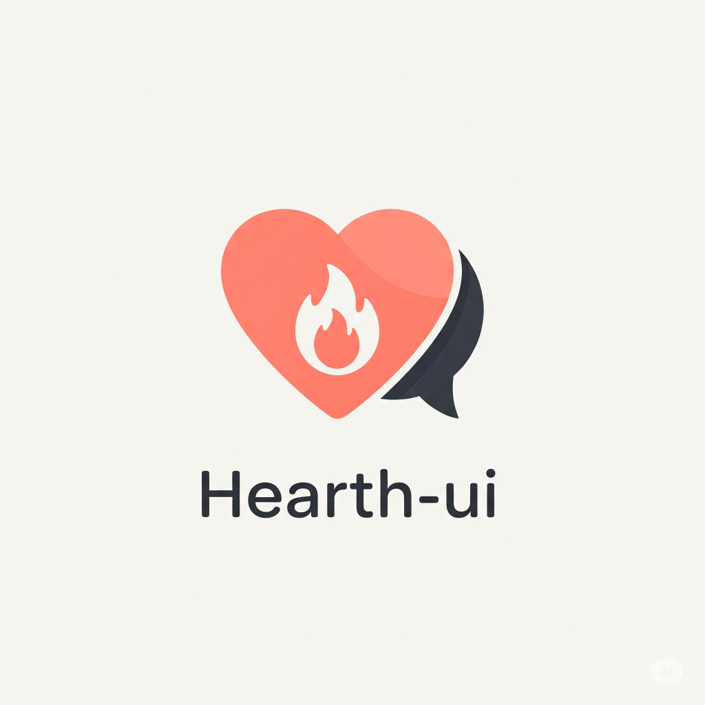

# Hearth-UI

**Hearth-UI** is a beautiful, local-first chat UI for [Ollama](https://ollama.com/), packaged for the web and desktop (Electron).  
It supports advanced features like file attachments, prompt queue, streaming responses, themes, markdown/code viewing, and session management.

  

## ✨ Features

- 🔄 Prompt streaming and prompt queue (ask while streaming!)
- 🗃️ Multi-session chat with rename/delete
- 🎨 Multi-theme with live preview
- 📝 Attach and drag files to chat; model can "see" text contents
- ⏹ Stop/cancel running answers
- 🦾 Markdown + syntax highlighting (ChatGPT style)
- 💾 Persistent chat history (in browser or Electron)
- 🔗 Export conversations

## 📦 Run Locally (Web)

1. **Clone the repo**  

2. **Install backend dependencies**  
    cd backend
    npm install

3. **Start backend (Ollama API proxy):**
    node server.js

4. **Serve frontend (static):**  
    In a new terminal tab:
    cd frontend
    npx http-server -p 8080

Open [http://localhost:8080](http://localhost:8080)

5. **Make sure [Ollama](https://ollama.com/) is also running** (default: `ollama serve`).

    ## 💻 Desktop App (Electron)
    
    You can also package as a portable desktop app (Windows, Mac, Linux).

    1. Install dependencies:
    2. Launch:
    3. **Electron auto-loads your frontend and connects to the backend**

        ## 📁 Project Structure
        
        - `/frontend`: UI (HTML/JS/CSS), drag-and-drop, themes, markdown, etc.
        - `/backend`: Simple Node API that bridges frontend to Ollama API
        - `main.js`: Electron main process (when building desktop app)
        - `/app-icon.png`: Your app icon
        - `package.json`: Scripts and build metadata
        
        ## 🤝 License
        
        MIT — build, customize, and share!
        
        ---
        
        ## 🔗 More
        - Ollama: https://ollama.com/
        - Electron: https://www.electronjs.org/
        - MarkedJS: https://marked.js.org/
        - highlight.js: https://highlightjs.org/
    
